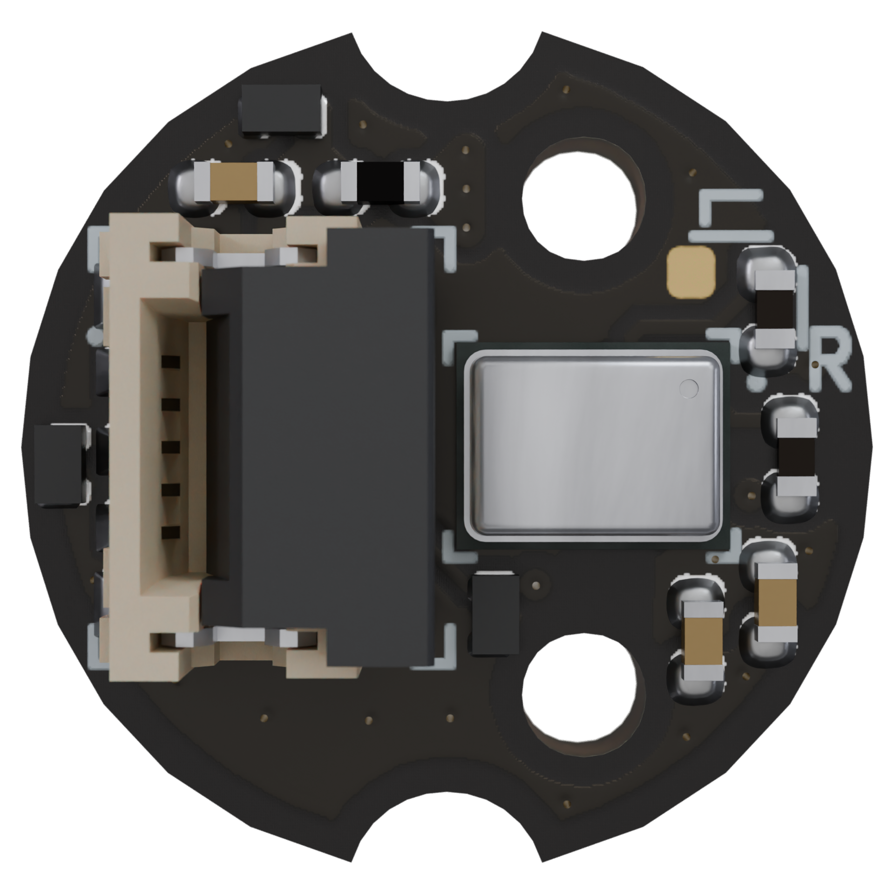

# Microphone board

Copyright (c) 2024-2025 [Antmicro](https://www.antmicro.com)

## Overview

This project contains open hardware design files for a microphone board with an SPH0644LM4H-1 PDM microphone.
The board break-routes PDM signals from the microphone to a zero insertion force connector.
Additionally, the board provides voltage filtering and ESD protection.

The design files were prepared in KiCad 8.x.

## Key features

* Knowles [SPH0644LM4H-1](https://www.mouser.com/datasheet/2/218/ph0644lm4h-1_revc-1518995.pdf)
* Zero insertion force connector for a 5 pin, 0.5 mm pitch FFC
* Selectable Left or Right channel audio transmitting
* Designed to fit an 11mm diameter opening
* Alignment cutouts for toolless mounting 

## Project structure

The main directory contains KiCad PCB project files, a LICENSE, and a README.
The remaining files are stored in the following directories:

* `doc` - contains schematics in PDF format
* `assets` - contains visual assets for showcasing this design on [Open Hardware Portal](https://openhardware.antmicro.com) and [System Designer](https://designer.antmicro.com)

## Licensing

This project is published under the [Apache-2.0](LICENSE) license.
